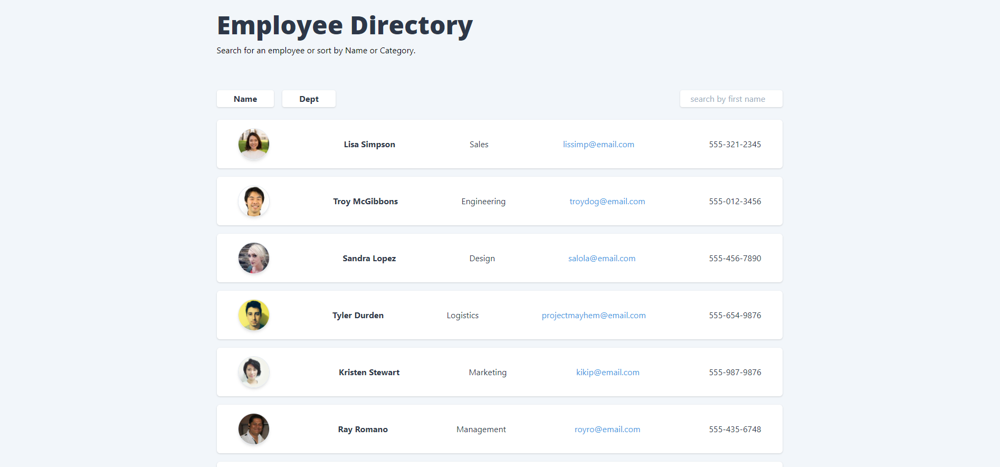

# Employee Directory
 #### [Demo](https://citenaresh.github.io/employee-directory/)


## Description

This is a [React](https://reactjs.org/) app that lets you view a list of employees, search for a specific employee, 
and sort the employee by either name or department. When you search for an employee it will immediately give you a 
result and clicking on the buttons will sort the employees either in ascending or descending order.
      

## Technologies

Project bootstrapped with [create-react-app](https://reactjs.org/docs/create-a-new-react-app.html#create-react-app). Uses 
[Tailwindcss](https://tailwindcss.com/) for styles. 

## Installation

To install dependencies make sure to run:

```
npm i 
```

## Demo

You can see a demo of this app [here](https://citenaresh.github.io/employee-directory/)

## Credits 
Great gratitude to Luca ([https://github.com/duvet86](https://github.com/duvet86)), Sam ([https://github.com/sam-ngu](https://github.com/sam-ngu)) from the UWA Bootcamp for their enormous help.
## Contributing 
I was the only one to work on this project, but of course I had help from my instructor, TA's, and classmates.

## License
[MIT](https://choosealicense.com/licenses/mit/)


